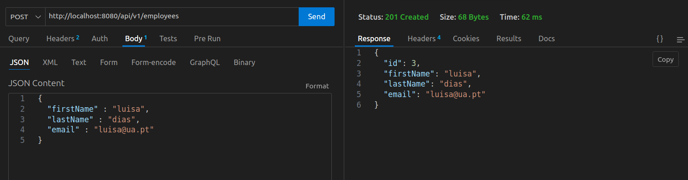
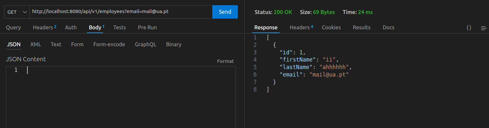
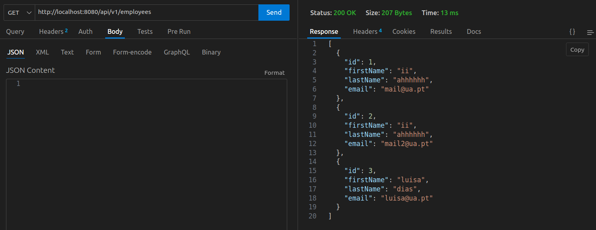

# IES_107658

## Notebook IES lab02

### Accessing databases in SpringBoot - lab03_1

No exercício 1, para se poder aceder a dases de dados e manipulá-las, usou-se a API Jakarta Persistence: https://www.infoworld.com/article/3379043/what-is-jpa-introduction-to-the-java-persistence-api.html

A Jakarta Persistence API é um linguagem standart que descreve uma interface como para framewoeks de persistência de dados, definindo um mapeamento objeto-relacional para objetos em Java.
Quado a SpringData usa a JPA, o código Java é independente da implementação específica da base de dados.

Começou-se por iniciar o projeto pelo SpringInitializr e seguiu-se o tutorial:https://www.baeldung.com/spring-boot-crud-thymeleaf.
As dependências já vêm generadas pelo SpringInitializr.
As dependências adicionas foram: Spring Web, Thymeleaf, Spring Data JPA, H2 database e Validation.

O exercício foi dividido em 3 domínios sendo necessário criar 3 ficheiros Java, um para o domain layer, um para o repository layer e um para o controller layer.

**Entidade User** - é uma classe responsável por modelar as entidades User.

    Entity(name = "tbl_user")
    public class User {
        
        @Id
        @GeneratedValue(strategy = GenerationType.AUTO)
        private long id;
        @NotBlank(message = "Name is mandatory")
        private String name;
        
        @NotBlank(message = "Email is mandatory")
        private String email;

        @NotBlank(message = "Age is mandatory")
        private String age;

        // standard constructors / setters / getters / toString
    }

**Repositório** - permite criar repositórios JPA-based permitindo acesso à camada de persistência sem ser necessário desenvolver implentações do zero. Ao extender a interface CrudRepository os objetos User podem utilizar as funcionalidades CRUD.

    @Repository
    public interface UserRepository extends CrudRepository<User, Long> {}

**Controler** - satisfaz pedidos HTTP Get e POST e mapea-os para uma chamada ao UserRepository. O método showSignUpForm() mostra um formulário de signup, enquanto que o método addUser() adiciona um novo utilizador à base de dados após a validação.

    @Controller
    public class UserController {
        
        private final UserRepository userRepository;

        @Autowired
        public UserController(UserRepository userRepository) {
            this.userRepository = userRepository;
        }
        
        @GetMapping("/signup")
        public String showSignUpForm(User user) {
            return "add-user";
        }
        
        @PostMapping("/adduser")
        public String addUser(@Valid User user, BindingResult result, Model model) {
            if (result.hasErrors()) {
                return "add-user";
            }
            
            userRepository.save(user);
            return "redirect:/index";
        }
        
        @GetMapping("/index")
        public String showUserList(Model model) {
            model.addAttribute("users", userRepository.findAll());
            return "index";
        }

        @GetMapping("/edit/{id}")
        public String showUpdateForm(@PathVariable("id") long id, Model model) {
            User user = userRepository.findById(id).orElseThrow(() -> new IllegalArgumentException("Invalid user Id:" + id));
            model.addAttribute("user", user);
            
            return "update-user";
        }
        
        @PostMapping("/update/{id}")
        public String updateUser(@PathVariable("id") long id, @Valid User user, BindingResult result, Model model) {
            if (result.hasErrors()) {
                user.setId(id);
                return "update-user";
            }
            
            userRepository.save(user);

            return "redirect:/index";
        }
        
        @GetMapping("/delete/{id}")
        public String deleteUser(@PathVariable("id") long id, Model model) {
            User user = userRepository.findById(id).orElseThrow(() -> new IllegalArgumentException("Invalid user Id:" + id));
            userRepository.delete(user);
            
            return "redirect:/index";
        }
    }

**Aplicação**

    @SpringBootApplication
    public class Lab03Application {

        public static void main(String[] args) {
            SpringApplication.run(Lab03Application.class, args);
        }

    }

É necessário criar templates html para criar a interface que mostra os formulários e lista as entidades User armazenadas.

## alinea c)

**The “UserController” class gets an instance of “userRepository through its constructor; how is this new repository instantiated**
O novo repositório é inicializado porque a classe UserController tem a anotação @Autowired. A anotação dá autorização ao construtor para injetar uma instância de UserRepository no objeto UserController para ser usado depois.

**List the methods invoked in the “userRepository” object by the “UserController”. Where are these methods defined?** 
Os métodos estão definidos na classe CrudRepository e são:  findAll(), save(), findById(), delete().

**Where is the data being saved?**
Os dados estão a ser guardados na base de dados h2, graças à dependência adicionada no projeto pelo Spring Initializr.

**Where is the rule for the “not empty” email address defined?**
Está definida na classe User através da anotação @NotBlank ao declarar a variável:
    @NotBlank(message = "Email is mandatory")
Caso não seja inserido um email é retornada a mensagem indicada de que o atributo é obrigatório.

### Multilayer applications: exposing data with REST interface - lab03_2

É necessária uma instância do MySQL server, e para isso foi usado docker. Pode-se criar a instância SQL usando o comando:
    $ docker run --name mysql5 -e MYSQL_ROOT_PASSWORD=secret1 -e MYSQL_DATABASE=demo -e MYSQL_USER=demo -e MYSQL_PASSWORD=secret2 -p 33060:3306 -d mysql/mysql-server:5.7

Os principais ficheiros do repositório criados são:

- pom.xml

    com as seguintes dependências:
        Spring Web
        Spring Data JPA
        MySQL driver
        DevTools
        Validation

- Employee.java (model folder)

- EmployeeRepository.java (repository folder)

- EmployeeController.java (controller folder)

Os últimos três ficheiros são idênticos aos do User do primeiro exercício.

Para ser possível correr a aplicação e a base de dados é necessário alterar as propriedades de conexão no ficheiro application.properties, disponível dentro da pasta resources.

    spring.datasource.url=jdbc:mysql://localhost:33060/demo
    spring.datasource.username=demo
    spring.datasource.password=secret2
    spring.jpa.database-platform=org.hibernate.dialect.MySQL5InnoDBDialect
    spring.jpa.properties.hibernate.dialect=org.hibernate.dialect.MySQLDialect
    spring.jpa.hibernate.ddl-auto=update

Para aceder ao browser pesquisa-se por: http://localhost:8080/api/v1/employees.

Foi adicionado também um novo método para efetuar a pesquisa de um employee por email, dentro do EmployeeRepository.
    public Employee findByEmailId(@Param("emailId") String emailId);

E no Controller foi adicionado um novo url:

    ``@GetMapping("/employees/{id}") //search an employee by email
    public ResponseEntity<Employee> getEmployeeById(@PathVariable(value = "id") Long employeeId){
        for(Employee employee : employeeRepository.findAll()){
            if(employee.getId()== employeeId){
                return ResponseEntity.ok().body(employee);
            }
        }

        System.out.println("Employee not found for this id :: " + employeeId);
        return null;
    }``

**POST de um employee**

  

**GET de um employee pelo seu email**

  

**GET de todos os employees**

  

**Nota: não foram colocados prints uma vez que deu um erro que não consegui resolver e não me permitiu executar o exercício**

### Wrapping-up and integrating concepts - lab03_3

Para a realização deste exercício foi usado como base o projeto Maven do exercício 4 do lab02.
De forma semelhante ao exercício anterior foi também usado docker sendo possível instanciar o MySQL server.

Os principais ficheiros do repositório criados são:

- Movie.java
- Quote.java

- MoviequotesController.java

- MovieRepository.java
- QuoteRepository.java

- Services.java

Foi modelado o código de maneira a criar uma relação many-to-one entre Movie e Quotes.

É possível adicionar uma chave estrangeira a uma entidade, por exemplo:
- movie_id porque um Movie pode ter uma ou mais Quotes.

    @JoinColumn(name = "movie_id", nullable = false)

Notas acerca das anotações para base de dados:

    @Table(name = "..."): associa uma entidade a uma tabela
    @Column(name = "...", nullable = [true | false]): associa um campo ou uma função a um campo da base de dados
    @ManyToOne(...): indica uma relação de um para muitos

De maneira a separar o controller do repository foi adicionado um componente @Service.
É o controller que permite a ligação HTTP, mas é o Service que responde a todos os pedidos. O Service contém toda a lógica e interage com o Repository.
**Nota: o RestController não deve ter nenhuma referência para o Repository!**

**Nota: não foram colocados prints uma vez que deu um erro que não consegui resolver e não me permitiu executar o exercício**